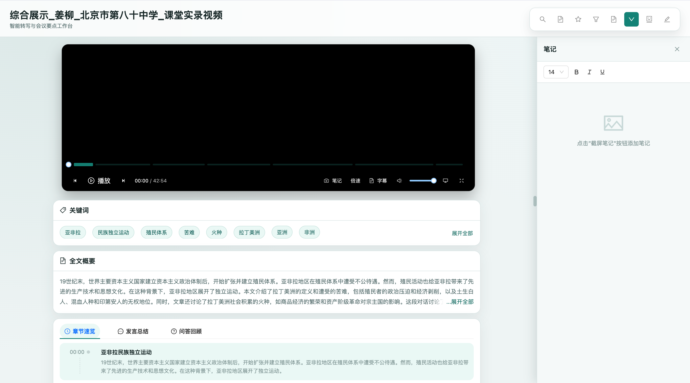

# 视频转写智能分析平台 (Video Transcript Viewer)

<p align="center">
  
</p>

<p align="center">
  
  
  
  
</p>

<p align="center">
  <b>基于 AI 的课堂视频智能分析系统</b><br>
  提供视频播放、语音转写、关键词提取、章节速览、笔记记录等一站式功能
</p>

---

## 📋 目录

- [项目概述](#项目概述)
- [技术架构](#技术架构)
- [环境搭建](#环境搭建)
- [后端服务](#后端服务)
- [项目结构](#项目结构)
- [核心功能](#核心功能)
- [二次开发指南](#二次开发指南)
- [部署流程](#部署流程)
- [贡献指南](#贡献指南)
- [常见问题](#常见问题)

---

## 项目概述

### 背景

在教育信息化和远程教学日益普及的背景下，如何高效地分析、回顾和利用课堂视频资源成为一个重要需求。本项目旨在提供一个智能化的视频分析平台，通过 AI 技术自动提取视频中的关键信息，帮助用户快速理解视频内容。

### 目标

- 提供流畅的视频播放体验，支持时间戳定位
- 实现语音转写内容的实时展示与同步
- 通过 AI 提取关键词、章节摘要、发言总结等智能信息
- 支持用户添加时间戳笔记，便于复习和回顾

### 主要功能

| 功能模块 | 描述 |
|---------|------|
| 🎬 **视频播放** | 支持进度控制、倍速播放、时间戳跳转 |
| 📝 **语音转写** | 实时展示转写文本，支持点击跳转对应视频位置 |
| 🏷️ **关键词提取** | AI 自动提取视频核心关键词，支持展开/收起 |
| 📚 **全文概要** | 智能生成视频内容摘要，快速了解视频主题 |
| 📑 **章节速览** | 自动划分章节，展示各时间段的内容概要 |
| 👤 **发言总结** | 按发言人汇总发言内容 |
| 📒 **笔记功能** | 支持在任意时间点添加图文笔记 |

---

## 技术架构

### 前端技术栈

| 技术 | 版本 | 用途 |
|------|------|------|
| React | 19.0.0 | 核心 UI 框架 |
| TypeScript | 5.7.3 | 类型安全开发 |
| Ant Design | 5.24.0 | UI 组件库 |
| Vite | 6.1.0 | 构建工具 |
| Day.js | 1.11.13 | 日期时间处理 |

### 后端技术栈

| 技术 | 用途 |
|------|------|
| FastAPI | 提供标记 GET/POST 接口 |
| Uvicorn | 本地开发服务 |

### 项目特点

- **TypeScript 全栈类型安全**：从数据接口到组件 props 完整类型定义
- **模块化组件设计**：各功能模块独立封装，便于维护和扩展
- **响应式布局**：适配不同屏幕尺寸
- **性能优化**：使用 useMemo、useCallback 等优化渲染性能

---

## 环境搭建

### 开发环境要求

- Node.js >= 18.0.0
- npm >= 9.0.0 或 yarn >= 1.22.0
- Git >= 2.30.0
- conda 已安装并可用

### 安装流程

1. **克隆项目**

```bash
git clone https://github.com/yy991207/ali.git
cd ali
```

2. **安装依赖**

```bash
npm install
```

3. **启动前端（推荐）**

```bash
bash scripts/dev_start.sh
```

4. **访问应用**

浏览器打开 http://localhost:3000

### 手动启动（可选）

```bash
npm run dev
```

### 构建生产版本

```bash
npm run build
```

构建产物将输出到 `dist/` 目录。

---

## 数据来源

### 真实接口

- 页面主数据直接由前端请求这两个真实接口：
  - `getTransResult`
  - `getAllLabInfo`
- 请求时会从 `config.yaml` 读取：
  - `X-Access-Token`
  - `resourceId`

### 本地标记存储

- 标记数据不再走 `8000` 本地服务。
- 当前改成浏览器 `localStorage` 持久化，按 `resourceId` 分开存储。

### 重要说明

- 现在是纯前端直连方案，`config.yaml` 里的 token 会进入浏览器构建产物。
- 这个方案只适合本地测试或临时联调，后续如果要正式部署，必须把 token 和接口代理迁回服务端。

---

## 项目结构

```
ali/
├── src/                          # 源代码目录
│   ├── components/               # 组件目录
│   │   ├── VideoPlayer/          # 视频播放器组件
│   │   │   ├── index.tsx         # 组件实现
│   │   │   └── index.css         # 组件样式
│   │   ├── TranscriptPanel/      # 转写面板组件
│   │   ├── SmartOverview/        # 智能概览组件
│   │   ├── NotePanel/            # 笔记面板组件
│   │   └── SidePanel/            # 侧边栏组件
│   ├── types/                    # TypeScript 类型定义
│   │   └── index.ts              # 全局类型定义
│   ├── utils/                    # 工具函数
│   │   └── time.ts               # 时间格式化工具
│   ├── services/                 # 前端数据服务
│   ├── App.tsx                   # 应用主组件
│   ├── App.css                   # 应用样式
│   ├── main.tsx                  # 应用入口
│   └── index.css                 # 全局样式
├── scripts/                      # 启动脚本
│   ├── dev_start.sh               # 启动前端
│   └── test_remote_interfaces.sh  # 真实接口自测脚本
├── config.yaml                   # 前端直连真实接口的本地配置
├── doc/                          # 文档目录（已忽略）
├── .gitignore                    # Git 忽略配置
├── index.html                    # HTML 模板
├── package.json                  # 项目依赖配置
├── tsconfig.json                 # TypeScript 配置
├── vite.config.ts                # Vite 构建配置
├── getAllLabInfo.json            # 示例数据：实验信息（仅保留做字段参考）
└── getTransResult.json           # 示例数据：转写结果（仅保留做字段参考）
```

---

## 核心功能

### 1. 视频播放器 (VideoPlayer)

**功能特性：**
- 标准视频播放控制（播放/暂停、进度条、音量）
- 倍速播放支持
- 时间戳同步：点击转写内容自动跳转到对应视频位置
- 当前播放时间实时同步到其他组件

**核心接口：**
```typescript
interface VideoPlayerProps {
  videoUrl: string;
  currentTime: number;
  onTimeUpdate: (time: number) => void;
  onVideoRef?: (ref: HTMLVideoElement | null) => void;
}
```

### 2. 智能概览 (SmartOverview)

**功能特性：**
- **关键词展示**：标签云形式展示，支持展开/收起
- **全文概要**：自动生成视频内容摘要
- **章节速览**：时间线形式展示各章节
- **发言总结**：按角色汇总发言内容

**数据结构：**
```typescript
interface SmartOverviewProps {
  keywords: KeywordItem[];
  agendaItems: AgendaItem[];
  roleSummary: RoleSummaryItem[];
  fullSummary: string;
  currentTime: number;
  onAgendaClick?: (item: AgendaItem) => void;
}
```

### 3. 转写面板 (TranscriptPanel)

**功能特性：**
- 展示语音转写文本
- 当前播放句子高亮显示
- 点击句子跳转视频对应位置
- 展示说话人信息

### 4. 笔记面板 (NotePanel)

**功能特性：**
- 在任意时间点添加笔记
- 自动捕获当前视频帧作为笔记配图
- 富文本编辑支持
- 时间戳快速跳转

---

## 二次开发指南

### 扩展方法

#### 1. 添加新的数据卡片

在 `SmartOverview` 组件中添加新的 Tab：

```typescript
const tabItems = [
  // ... 现有 tabs
  {
    key: 'newFeature',
    label: (
      <span className="tab-label">
        <NewIcon />
        新功能
      </span>
    ),
    children: <NewFeatureComponent data={newData} />
  }
];
```

#### 2. 自定义视频数据源

修改 `App.tsx` 中的数据加载逻辑：

```typescript
useEffect(() => {
  // 替换为实际 API 调用
  fetch('/api/video-data')
    .then(res => res.json())
    .then(data => {
      setLabInfo(data.labInfo);
      setTransResult(data.transResult);
    });
}, []);
```

#### 3. 扩展类型定义

在 `src/types/index.ts` 中添加新类型：

```typescript
export interface NewFeatureItem {
  id: number;
  value: string;
  // 添加自定义字段
}
```

### API 文档

#### 时间格式化工具

```typescript
// src/utils/time.ts

/**
 * 将毫秒转换为时分秒格式
 * @param ms 毫秒数
 * @returns 格式化后的时间字符串 (如: 01:23:45)
 */
export function formatTimeFromMs(ms: number): string;

/**
 * 将秒转换为时分秒格式
 * @param seconds 秒数
 * @returns 格式化后的时间字符串
 */
export function formatTimeFromSeconds(seconds: number): string;
```

### 自定义配置

#### 主题定制

修改 `src/index.css` 中的 CSS 变量：

```css
:root {
  --primary-color: #605ce5;
  --primary-hover: #4a3f8c;
  --bg-color: #f5f5f5;
  --text-color: #333;
}
```

#### 智能概览配置

在 `SmartOverview/index.tsx` 中调整默认显示数量：

```typescript
const DEFAULT_KEYWORDS_COUNT = 8;  // 默认显示关键词数量
const DEFAULT_SUMMARY_LENGTH = 60; // 摘要截断长度
```

---

## 部署流程

### 静态部署

1. **构建项目**

```bash
npm run build
```

2. **部署到服务器**

将 `dist/` 目录下的文件上传到任意静态文件服务器：

- Nginx
- Apache
- GitHub Pages
- Vercel
- Netlify

### Nginx 配置示例

```nginx
server {
    listen 80;
    server_name your-domain.com;
    root /var/www/ali/dist;
    index index.html;

    location / {
        try_files $uri $uri/ /index.html;
    }
}
```

### Docker 部署

创建 `Dockerfile`：

```dockerfile
FROM node:18-alpine as builder
WORKDIR /app
COPY package*.json ./
RUN npm install
COPY . .
RUN npm run build

FROM nginx:alpine
COPY --from=builder /app/dist /usr/share/nginx/html
COPY nginx.conf /etc/nginx/conf.d/default.conf
EXPOSE 80
```

---

## 贡献指南

### 开发规范

1. **代码风格**
   - 使用 TypeScript 严格模式
   - 组件使用函数式组件 + Hooks
   - 遵循 Ant Design 设计规范

2. **命名规范**
   - 组件名：PascalCase（如 `VideoPlayer`）
   - 文件名：与组件名一致
   - 变量/函数：camelCase
   - 类型/接口：PascalCase

3. **提交规范**
   ```
   feat: 新功能
   fix: 修复问题
   docs: 文档更新
   style: 代码格式调整
   refactor: 重构
   perf: 性能优化
   test: 测试相关
   chore: 构建/工具相关
   ```

### 提交 PR 流程

1. Fork 本仓库
2. 创建功能分支：`git checkout -b feature/your-feature`
3. 提交更改：`git commit -m 'feat: add some feature'`
4. 推送分支：`git push origin feature/your-feature`
5. 创建 Pull Request

---

## 常见问题

### Q: 视频无法播放？

A: 检查视频 URL 是否可访问，浏览器是否支持该视频格式（推荐 MP4）。

### Q: 转写数据如何获取？

A: 当前使用本地 JSON 数据，生产环境需接入实际转写 API。

### Q: 如何修改默认展开的关键词数量？

A: 修改 `SmartOverview/index.tsx` 中的 `DEFAULT_KEYWORDS_COUNT` 常量。

### Q: 支持哪些浏览器？

A: 支持 Chrome、Firefox、Safari、Edge 等现代浏览器。

### Q: 如何添加多语言支持？

A: 可集成 react-i18next 实现国际化，在 `src/locales/` 目录添加语言文件。

---

## 联系方式

- **项目地址**: https://github.com/yy991207/ali
- **问题反馈**: https://github.com/yy991207/ali/issues
- **邮箱**: your-email@example.com

---

## 许可证

[MIT](LICENSE) © 2024 Video Transcript Viewer Team
